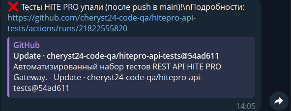
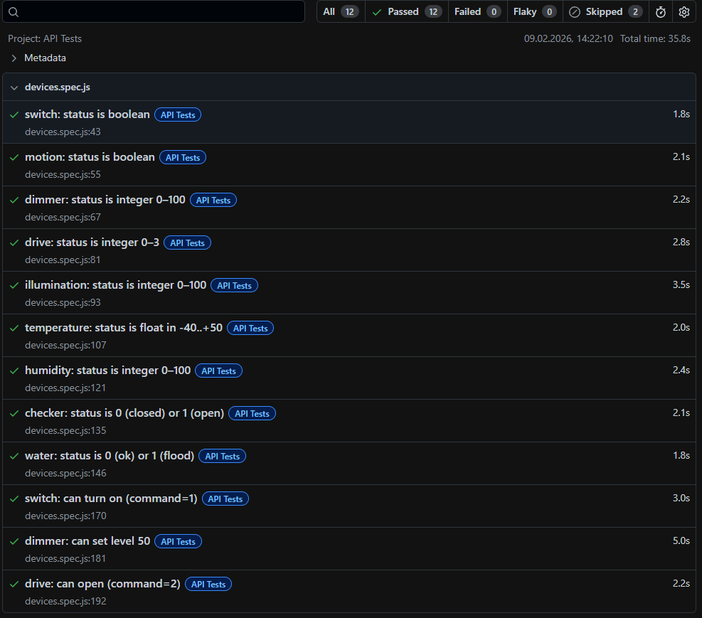

## 🏠 HiTE PRO Gateway - API тесты

[](LICENSE)

Автоматизированные тесты REST API шлюза умного дома **HiTE PRO Gateway** на основе официальной спецификации
([копия в репозитории](./docs/API_HITE_PRO.pdf)).

---
## 📚 Содержание

- [🏠 Описание](#-описание)
- [🔌 Поддерживаемые типы устройств](#-поддерживаемые-типы-устройств)
- [📡 Ресурсы API](#-ресурсы-api)
- [🧪 Покрытие тестами](#-покрытие-тестами)
- [🚀 Установка и запуск](#-установка-и-запуск)
- [🔐 Настройка CI/CD и секретов](#-настройка-cicd-и-секретов)
- [📊 Отчёты и уведомления](#-отчёты-и-уведомления)
- [📁 Структура проекта](#-структура-проекта)
- [🛡️ Безопасность](#-безопасность)
---

## 🏠 Описание

Тесты написаны на **JavaScript** с использованием фреймворка **Playwright** в режиме API-only.  
Они проверяют:
- Получение списка устройств и сценариев.
- Чтение состояния устройств (согласно типам).
- Управление устройствами (реле, диммеры, приводы, RGBW).
- Обработку ошибок (401, 404, 405).
- Отправку логов и webhook'ов (для `transmitter`).

---

## 🔌 Поддерживаемые типы устройств

### Управляемые устройства

| Тип | Состояние (`status`) | Управление (`command`) |
|-----|----------------------|------------------------|
| `switch` | `boolean` | `1` – Включить<br>`2` – Выключить<br>`3` – Импульс |
| `dimmer` | `int` (0–100) | `0` – Выключить<br>`1–100` – Яркость<br>`101` – Восстановить прошлый уровень |
| `drive` | `int`<br>`0=Открыт`<br>`1=Закрыт`<br>`2=Открытие`<br>`3=Закрытие` | `2` – Открыть<br>`3` – Закрыть<br>`4` – Остановить |

### Цветные устройства

| Тип | Состояние | Управление |
|-----|----------|-----------|
| `LED3S/M` | `status: int (0–100)`<br>`color: string (HEX)` | `PUT /devices/{id}/{level}?color=fc0841` |
| `RGBW` | `status: int (0–100)`<br>`color: HEX`<br>`colorTemperature: int (0–3600)`<br>`effect: int (0–10)` | `PUT /devices/{id}/100?color=...`<br>`colorTemperature=1500–6500`<br>`effect=0–9` |

> ⚠️ При чтении `colorTemperature` возвращается `0–3600`, при управлении допустимо `1500–6500`.

### Датчики (только чтение)

| Тип | Формат `status` | Значения |
|-----|----------------|---------|
| `motion` | `boolean` | `true`/`false` |
| `illumination` | `int` | `0–100` |
| `temperature` | `float` | `-40 … +50` |
| `humidity` | `int` | `0–100` |
| `checker` | `int` | `0=Закрыто`, `1=Открыто` |
| `water` | `int` | `0=Норма`, `1=Залив` |
| `power` | `int` | `0=Нет напряжения`, `1=Есть` |
| `transmitter` | **Не возвращает `status`** | Состояние только через **webhook** |

---
## 📡 Ресурсы API

- Базовый URI:
  - Локальный: `http://hitepro.local/rest/`
  - По IP: `http://<IP>/rest/`
  - Внешний: `https://<внешний_ключ>.connect-profi.ru/rest/`

- Авторизация: **Basic Auth**

- Методы:
  - `GET /devices/` → список устройств
  - `GET /devices/{id}` → состояние (или `404`, если нет обратной связи)
  - `PUT /devices/{id}/{command}` → управление
  - `PUT /devices/{id}/{level}?color=...&colorTemperature=...&effect=...` → RGBW
  - `GET /logs/device/?id=...` → логи устройства
  - `GET /logs/scenario/?id=...` → логи сценария

- Коды ответа:
  - `200` – OK
  - `401` – Unauthorized
  - `404` – Not Found (устройство без обратной связи или несуществующий ID)
  - `405` – Method Not Allowed (например, PUT на датчик)

---
## 📑 Покрытие тестами

### Позитивные сценарии

- ✅ Получение списка устройств и сценариев
- ✅ Чтение состояния всех типов датчиков
- ✅ Управление реле, диммерами, приводами
- ✅ Управление цветом, цветовой температурой и эффектами RGBW
- ✅ Чтение логов устройств и сценариев

### Негативные сценарии

- ✅ Обработка ошибок авторизации (`401`)
- ✅ Обработка несуществующих ID (`404`)
- ✅ Обработка попыток отправки команд на датчики (`405`)
- ✅ Валидация значений команд (например, `150` для диммера)

---
## 🚀 Установка и запуск
```bash
    git clone https://github.com/cheryst24-code-qa/hitepro-api-tests.git
    cd hitepro-api-tests
    npm install
    cp .env.example .env  # ← укажите HITEPRO_BASE_URL, USER, PASS
    npm test
    npx playwright show-report
```
## 🔐 Настройка CI/CD и секретов
    GitHub Actions
    Запуск при push и по расписанию (0 * * * *)
    HTML-отчёт как артефакт
    Уведомления в Telegram при падении тестов
    Секреты
    Добавьте в Settings → Secrets and variables → Actions:
    HITEPRO_BASE_URL – базовый URL API
    HITEPRO_USER – имя пользователя
    HITEPRO_PASS – пароль
    TELEGRAM_BOT_TOKEN – токен бота
    TELEGRAM_CHAT_ID – ID чата

## 📊 Отчёты и уведомления
    HTML-отчёты Playwright доступны как артефакт GitHub Actions.
    При падении тестов — уведомление в Telegram с результатом и ссылкой на запуск.
| Telegram-уведомление | HTML-отчёт |
|----------------------|------------|
|  |  |

## 📁 Структура проекта

  ├── tests/
  │   └── devices.spec.js       # Основные API-тесты
  ├── docs/
  │   ├── specification.md      # Копия спецификации API
  │   ├── screenshots/
  │   │   ├── tg_report.png
  │   │   └── html_report.png
  │   └── CI_CD_CHECKLIST.md    # Чек-лист настройки CI/CD
  ├── .env.example              # Шаблон переменных окружения
  ├── .gitignore                # Файлы, исключённые из Git
  ├── playwright.config.js      # Конфигурация Playwright
  └── package.json              # Зависимости проекта

## 🛡️ Безопасность
    .env находится в .gitignore
    Секреты передаются через GitHub Secrets
    .env.example не содержит чувствительных данных